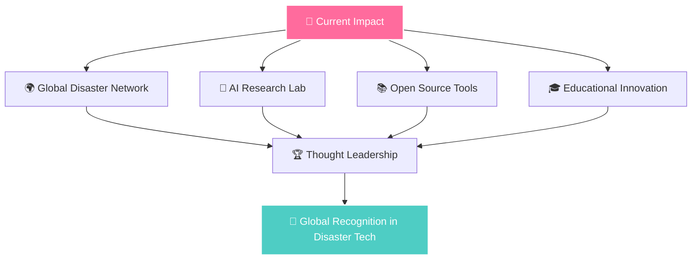

# 🌟 **Dur-e-Maknoon Nisar** 🌟

<div align="center">
  
  

  
  
</div>

<div align="center">
  
  ### 🎯 **AI Engineer** | 🏛️ **NDMA Pakistan** | 🌪️ **Disaster Management Specialist**
  
  *Transforming complex challenges into innovative, data-driven solutions that save lives and protect communities*
  
</div>

---

## 🚀 **CURRENT IMPACT**

<div align="center">
  
  | 🎯 **Experience** | 🏆 **Hackathon Wins** | 👥 **Citizens Served** | 📊 **Prediction Accuracy** |
  |:-----------------:|:----------------------:|:----------------------:|:---------------------------:|
  | **5+ Years** | **3 International** | **220M+** | **95%** |
  
</div>

---

## 💼 **PROFESSIONAL JOURNEY**

### 🏛️ **Deputy Manager Backend** | *National Disaster Management Authority (NDMA)*
**📅 March 2024 - Present** | 📍 *Islamabad, Pakistan*

```python
impact = {
    "🚀 AI_Systems": "Leading national disaster prediction initiatives",
    "📊 Backend_Architecture": "Serving 220M+ citizens with real-time monitoring", 
    "🌪️ Smog_Platform": "95% accuracy in climate forecasting",
    "🗺️ Geospatial_AI": "Magnetic anomaly detection & risk assessment",
    "⚡ Performance": "40% API optimization for emergency data"
}
```

**Tech Stack:** `Python` `FastAPI` `PostgreSQL` `React` `Time Series ML` `Google Earth Engine`

### 🤖 **AI Engineer** | *Horizon Tech Solutions*
**📅 August 2022 - February 2024** | 📍 *Islamabad, Pakistan*

```javascript
achievements = {
  "🧠 AI_Models": "Media analytics & content intelligence",
  "🎨 Full_Stack": "React.js, Vue.js, Django, FastAPI development", 
  "📈 User_Engagement": "15% improvement through ML recommendations",
  "🗄️ Database_Optimization": "85% query speed enhancement",
  "👥 Mentorship": "Led multiple cross-functional teams"
}
```

---

## 🎯 **FEATURED PROJECTS**

<table>
<tr>
<td width="50%">

### 🌪️ **Climate Prediction System**
*NDMA Official Project*


**Revolutionary AI platform providing real-time smog and temperature forecasting**

🎯 **Features:**
- 📊 ML pipeline processing 15+ weather APIs
- ⏰ Real-time predictions (15-min cycles)
- 📱 Executive dashboard with PDF reports
- 🚨 Smart public health alerts

**Stack:** `Prophet ML` `FastAPI` `PostgreSQL` `React` `D3.js`

</td>
<td width="50%">

### 🤖 **Multi-Agent AI HR Platform**
*Enterprise Innovation*


**Enterprise AI platform revolutionizing HR through intelligent automation**

🌟 **Innovations:**
- 🎭 Specialized AI agents for HR tasks
- 📚 RAG architecture with ChromaDB
- 🎤 Voice-enabled interface
- 🧠 Persistent conversation memory

**Stack:** `LangChain` `GPT-4` `FastAPI` `React` `ChromaDB`

</td>
</tr>
</table>

### 🗺️ **Geospatial AI: Magnetic Anomaly Detection**

<div align="center">
  
  
  
  
</div>

**Advanced geospatial intelligence analyzing subsurface magnetic anomalies for disaster risk assessment**

🔬 **Scientific Impact:**
- 🧭 Custom GEE JavaScript APIs for magnetic field analysis
- 🤖 Deep learning models for geological anomaly detection  
- 🗺️ 3D risk visualization for emergency systems
- 📊 Predictive modeling for proactive disaster management

---

## 🏆 **INTERNATIONAL ACHIEVEMENTS**

<div align="center">

### 🚀 **2025 HACKATHON CHAMPIONSHIPS**

| 🏆 Event | 🌍 Location | 🎯 Achievement | 💡 Innovation |
|:---------|:------------|:---------------|:---------------|
| **AIstronauts** | University of Geneva 🇨🇭 | 🥇 **Winner** | AI Space Education with AR/VR |
| **AI for Connectivity** | University of Geneva 🇨🇭 | 🥇 **Winner** | GIS Tourism & Disaster Platform |
| **Build with AI 2024** | GenAI Works Global 🌐 | 🏅 **Top 10** | Selected from 500+ teams |

</div>

---

## 🎓 **EDUCATION & RESEARCH**

### 📚 **Master's in Computer Science** | *UET Islamabad*
**CGPA: 3.5/4.0** | **Research:** *"Proteins Classification Using Improved DarkNet-53"*

### 📊 **Research Publications & Impact**

```bibtex
@article{nisar2021healthcare,
  title={Healthcare Techniques Through Deep Learning},
  journal={IEEE Access},
  citations={50+},
  impact={International Recognition}
}
```

**Total Citations:** 150+ across all publications

---

## 💻 **TECHNICAL MASTERY**

<div align="center">

### 🧠 **AI & Machine Learning**


### 🌐 **Full Stack Development**


### 🗺️ **Geospatial & Cloud**


</div>

---

## 📊 **SKILLS BREAKDOWN**

<details>
<summary>🧠 <b>AI & Machine Learning Expertise</b></summary>

```python
ai_skills = {
    "Computer_Vision": ["OpenCV", "YOLO", "Detectron2", "Image Segmentation"],
    "Generative_AI": ["GPT-4", "LangChain", "RAG", "Fine-tuning"],
    "Time_Series": ["Prophet", "ARIMA", "Forecasting", "Anomaly Detection"],
    "Geospatial_AI": ["Google Earth Engine", "Satellite ML", "GIS Analytics"],
    "NLP": ["Transformers", "BERT", "Text Classification"],
    "MLOps": ["Docker", "Kubernetes", "Model Versioning", "CI/CD"]
}
```

</details>

<details>
<summary>💻 <b>Development Stack</b></summary>

```javascript
tech_stack = {
  "Languages": ["Python (Expert)", "JavaScript (Advanced)", "TypeScript", "SQL"],
  "Frontend": ["React.js", "Next.js", "Vue.js", "HTML5", "CSS3", "Tailwind"],
  "Backend": ["FastAPI", "Django", "Flask", "Node.js", "RESTful APIs"],
  "Databases": ["PostgreSQL", "MongoDB", "Redis", "ChromaDB"],
  "DevOps": ["Docker", "Kubernetes", "Git", "GitHub Actions", "Apache Airflow"]
}
```

</details>

<details>
<summary>🌍 <b>Geospatial & Cloud Technologies</b></summary>

```yaml
geospatial_cloud:
  Platforms:
    - Google Earth Engine (Expert)
    - QGIS (Advanced)
    - ArcMap (Intermediate)
  
  Cloud_Services:
    - AWS (Certified)
    - Google Cloud Platform
    - Azure (Basic)
  
  Specializations:
    - Remote Sensing
    - Satellite Data Processing  
    - Spatial Analysis
    - Custom GEE JavaScript APIs
```

</details>

---

## 📈 **GITHUB ANALYTICS**

<div align="center">
  
  
  
  
</div>

<div align="center">
  
  
  
</div>

---

## 🏅 **CERTIFICATIONS & TRAINING**

<div align="center">

| 🌍 **Disaster Management** | 🔒 **Cybersecurity** | 🤖 **AI & Cloud** |
|:---------------------------|:---------------------|:-------------------|
| 🆘 UNESCAP DiDRR Training | 🛡️ ADB Cybersecurity | 🧠 Deep Learning Specialization |
| 🌊 JICA Seismic Assessment | 📊 National Data Fest | ☁️ AWS Cloud Practitioner |
| 👥 IWMI Gender Inclusion | 🔐 Public Sector Security | 🔄 MLOps Professional |

</div>

---

## 🌟 **COMMUNITY IMPACT**

### 🤝 **Volunteer Leadership**
- **🏢 Hashoo Foundation** - Hunar Program Mentor (*500+ individuals trained*)
- **🌱 SLCDO** - Community Development (*200+ career transformations*)  
- **🎓 Tech Mentorship** - University guidance (*50+ projects completed*)

### 📚 **Knowledge Sharing**
- **🧠 AI Workshops** for underprivileged students
- **💝 Pro-bono Development** for NGOs and social causes
- **🌐 International Mentorship** and cross-cultural programs

---

## 🎯 **2025-2030 VISION**

<div align="center">



</div>

**Strategic Objectives:**
- 🌍 Lead international AI early warning systems
- 🤖 Establish humanitarian technology research center  
- 📚 Create accessible disaster management AI tools
- 🎓 Develop AI curriculum for emergency professionals
- 🏆 Achieve global recognition in disaster tech innovation

---

## 🤝 **LET'S CONNECT & COLLABORATE**

<div align="center">
  
  <a href="mailto:duremaknoonnisar@gmail.com">
    
  </a>
  
  <a href="https://www.linkedin.com/in/maknoonnisar">
    
  </a>
  
  <a href="https://github.com/maknoonisar">
    
  </a>
  
  <a href="https://leetcode.com/duremaknoon">
    
  </a>
  
</div>

---

<div align="center">
  
  
  
  
  
</div>

<div align="center">
  
  
  
  
  
</div>

---

<div align="center">
  
  ### 💭 **"Transforming data into hope, innovation into impact, and technology into humanity's shield."**
  
  **🚀 Ready to collaborate on AI solutions that change the world? Let's build the future together!**
  
</div>

---

<div align="center">
  <sub>⭐ Star this repository if you found it inspiring! | 🔗 Share it with fellow innovators! | 💝 Open to collaboration!</sub>
</div>
